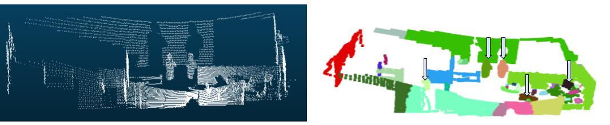

# Adaptive Clustering DEMO
This demo shows the adaptive clustering using Python. 

To run the demo install the basic packages such as **numpy**, **open3d** and **sklearn**, and run the **demo_adaptive_clustering/adaptive_clustering_demo.py**.

    cd demo_adaptive_clustering/
    python adaptive_clustering_demo.py

make sure all libraries are installed and proper virtual enviroment, if using, is activated. 


Below show the integration of adaptive clustering with ROS on live Ouster 3D LiDAR


Visual illustration of clustering on a 3D point cloud in an indoor environment. The left
image shows the original point cloud, while the right image displays the clusters identified by adaptive clustering as
candidate objects. The arrows in the right image indicate the clusters that remain after filtering and
are passed to the classifier.

## Citation ##
If you are considering using this code, please reference the following:
```
@article{Baber2024,
   author = {Junaid Baber and Olivier Aycard},
   title = {3D-PSH: 3D LiDAR Object Detection Using Adaptive Clustering and 3D Point Spatial Histograms},
   journal = {Submitted for peer-review},
   year = {2024}
}
```
